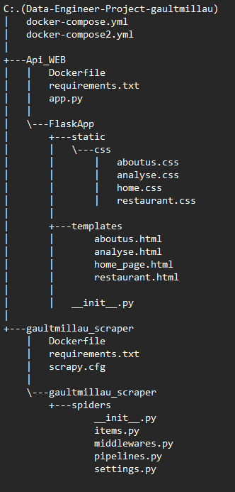

# Sommaire

## Guide de l'utilisateur
1. [Prérequis d'installation](#1---Prérequis-dinstallation)
2. [Installation](#2---Installation)
3. [Présentation du Dashboard](#3---Présentation-du-dashboard)


# Guide de l'utilisateur

## 1 - Prérequis d'installation

Dans un premier temps, regardons ce que vous devez installer pour récupérer et utiliser le projet.

Deux outils sont nécessaires :

Git pour cloner le projet depuis le dépôt opensource GitHub.
DockerDesktop pour faire fonctionner le projet.
Faites une installation classique.

## 2 - Installation

Dans cette partie, nous allons importer le projet disponible sur GitHub afin de l’avoir sur votre machine (en local).

Pour ce faire, ouvrez le Git Bash ou tout autre terminal et rendez-vous dans le dossier où vous désirez stocker le projet grâce à la commande :
```
   $ cd <répertoire désiré>/
```
Lorsque vous êtes dans le dossier voulu, rentrez la commande suivante :
```
   $ git clone https://github.com/cambiere/E4-DataEngineerProject
```
⚠ Attendez l'importation totale du projet
