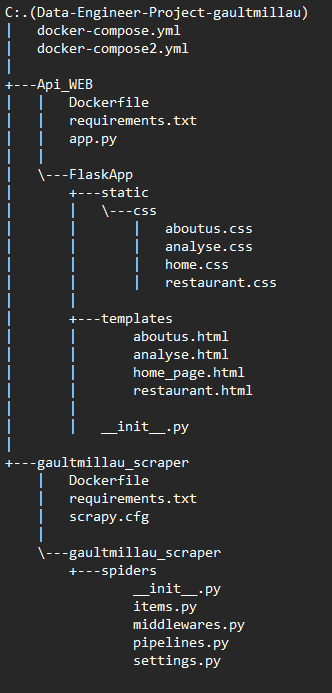

<div align="center">

</div>
<a id="readme-top"></a>

# Description

Ce projet vise à extraire des données depuis le site 'gaultmillau.com', les stocker dans une base de données Elasticsearch, et les rendre consultables à travers une application Web créée avec Flask.
Pour offrir une expérience utilisateur fluide, nous avons utilisé Elasticsearch pour optimiser les capacités de recherche et conçu une interface interactive en combinant CSS et JavaScript. Le projet s’appuie sur Docker pour simplifier le déploiement, automatiser l’exécution des différentes étapes (scraping, stockage, service Web) et garantir une reproductibilité optimale sur différents environnements.

<a id="readme-top"></a>
# Sommaire

## Guide de l'utilisateur
1. [Prérequis d'installation](#1---Prérequis-dinstallation)
2. [Installation](#2---Installation)
3. [Lancer le projet](#3---Lancer-le-projet)
4. [Les différentes pages](#4---Les-differentes-pages)

## Guide du Développeur
1. [Aperçu global du projet](#1---Aperçu-global-du-projet)
2. [Scraping](#2---Scraping)
3. [API Web](#3---API-Web)
4. [Architecture et technologies utilisées](#4---Architecture-et-technologies-utilisées)

## Pour aller plus loin
1. [Idées d'améliorations](#1---Idées-daméliorations)
2. [Défis rencontrés](#2---Défis-rencontrés)
3. [Bugs connus](#3---Bugs-connus)


# Guide de l'utilisateur

## 1 - Prérequis d'installation

Dans un premier temps, regardons ce que vous devez installer pour récupérer et utiliser le projet.

Deux outils sont nécessaires :

[Git](https://github.com/cambierelliot/E4-DataEngineerProject) pour cloner le projet depuis le dépôt opensource GitHub.

[DockerDesktop](https://www.docker.com/products/docker-desktop/) pour faire fonctionner le projet.

Faites une installation classique de docker.

## 2 - Installation

Dans cette partie, nous allons importer le projet disponible sur GitHub afin de l’avoir sur votre machine (en local).

Pour ce faire, ouvrez le Git Bash ou tout autre terminal et rendez-vous dans le dossier où vous désirez stocker le projet grâce à la commande :
```
   $ cd <répertoire désiré>/
```
Lorsque vous êtes dans le dossier voulu, rentrez la commande suivante :
```
   $ git clone https://github.com/cambiere/E4-DataEngineerProject
```
⚠ Attendez l'importation totale du projet

## 3 - Lancer le projet

Commencez par rejoindre le dossier du projet :

```
   $ cd E4-DataEngineerProject/
```
Une fois que vous êtes bien dans ce répertoire, veuillez lancer l'application docker (e.g. DockerDesktop sur Windows). Elle doit être en fonctionnement pour continuer.

Pour exécuter le projet, il suffit de rentrer la commande suivante
```
$ docker compose up -d
```


Patientez jusqu'à l'apparition d'un groupe de conteneurs dans votre application Docker. Cela peut prendre quelques minutes, car le processus de scraping est en cours. Un volume est également créé pour les lancements ultérieurs : le scraping ne sera alors plus nécessaire, et les données locales seront utilisées.

⚠ Veillez à ne pas arrêter les services pour le bon fonctionnement de l'application Web.

Une fois le service flask en vert, vous pouvez cliquer sur le port surligné en jaune 5000 :5000 (voir image ci-dessous) ou bien cliquer ici : http://localhost:5000/


<p align="center">(<a href="#readme-top">Haut de la page</a>)</p>

## 4 - Les différentes pages

<div align="center">
<h3>Page d'accueil du site</h3>
</div>


La page d'accueil du site présente un design élégant et intuitif, permettant aux utilisateurs de rechercher et découvrir des restaurants selon leurs préférences. Voici les principales caractéristiques de cette page :

#### Barre de recherche personnalisée
- Trois menus déroulants pour affiner les critères de recherche :
  - **Département** : Permet de sélectionner une région géographique.
  - **Type de cuisine** : Offre des options comme "Français", "Italien", "Japonais", etc.
  - **Note minimale** : Permet de filtrer les restaurants en fonction de leur score.
- Un bouton **"Rechercher"** pour effectuer la recherche selon les critères sélectionnés.

#### Navigation rapide par types de cuisine
- Une section en dessous de la barre de recherche met en avant **6 types de cuisine populaires**.
- Chaque catégorie est **cliquable** et redirige l'utilisateur vers une page dédiée pour explorer des restaurants spécifiques.

#### Header interactif
- Un header fixe contenant des liens vers les sections principales du site :
  - **Les restaurants**
  - **Analyse**
  - **À propos de nous**
- Le header disparaît automatiquement lors du défilement vers le bas pour laisser plus d'espace à l'utilisateur et réapparaît en haut.

#### Footer informatif
- Le footer inclut des liens supplémentaires, des informations sur les auteurs du projet et un design sobre pour clôturer la page.

<div align="center">
<h3> Page exploration restaurant </h3>
</div>

<div align="center">
<h3> Page d'analyse </h3>
</div>

<div align="center">
<h3> Page a propos de nous </h3>
</div>


La page "À propos de nous" présente les contributeurs principaux du projet avec leurs profils respectifs et les outils utilisés dans le développement du site.

- **Présentation des contributeurs** : Chaque contributeur est affiché avec une photo, un descriptif de son parcours, et ses domaines d'expertise.
- **Contact direct** : Les adresses email des contributeurs sont fournies pour toute communication.
- **Technologies utilisées** : Une section en bas met en avant les principaux outils et technologies comme Elasticsearch, Docker, Scrapy, GitHub, et Flask.

<p align="center">(<a href="#readme-top">Haut de la page</a>)</p>

# Guide du Développeur

## 1 - Aperçu global
Le projet propose une solution intégrée permettant de scrapper les données de restaurants depuis **Gault & Millau**, de les stocker dans **Elasticsearch**, et de les rendre accessibles via une application web construite avec **Flask**. L'architecture repose sur Docker pour assurer un déploiement reproductible.

## 2 - Scrapping
Le scrapping utilise **Python** et des bibliothèques telles que **BeautifulSoup** pour analyser les pages HTML et **Requests** pour l’envoi des requêtes. Le processus extrait :
- Noms des restaurants.
- Adresses et coordonnées GPS.
- Spécialités culinaires.
- Notes.

Les données structurées sont importées dans Elasticsearch en tant qu'index.

## 3 - API Web
Le backend, basé sur **Flask**, offre des endpoints pour :
- Afficher la liste des restaurants.
- Obtenir des détails spécifiques à un restaurant.
- Rechercher par mot-clé ou critères (ex. spécialité, localisation).

## 4 - Architecture et technologies utilisées
- **Backend** : Python, Flask.
- **Scraping** : BeautifulSoup, Requests.
- **Base de données** : Elasticsearch.
- **Frontend** : HTML/CSS/JS.
- **Déploiement** : Docker Compose.

 

<p align="center">(<a href="#readme-top">Haut de la page</a>)</p>

# Pour aller plus loin

## 1 - Idées d'améliorations
- Ajouter des **filtres dynamiques** (par budget, distance).
- Intégrer une **interface mobile-friendly** ou créer une app mobile.
- Mettre en place une **API REST avancée** pour d’autres types de clients (apps tierces).

## 2 - Défis rencontrés
- Contournement des **limitations des sites web** (CAPTCHA, restrictions IP).
- Optimisation des requêtes Elasticsearch.
- Assurer une **compatibilité front-end** entre navigateurs.

## 3 - Bugs connus
- [en partie résolu] Il se peut qu'une des pages du site de gault et millau soit down et que le scrapping s'arrête plus tôt. La page est donc skip mais reste manquante jusqu'à que les créateurs du site répare le problème
- De temps en temps, suite au scrapping, le graphique réprésentant les notes dans la partie analyse est totalement incohérent (affichant 400 notes à 12 et 12.5 et rien d'autres)

Si vous rencontrez d'autres bugs n'hesitez pas à nous contacter. 

<p align="center">(<a href="#readme-top">Haut de la page</a>)</p>

**Owen et Elliot**

*Notre recette : un projet bien épicé, une pincée de code, et beaucoup de passion. 🧑‍🍳💻*

*Bonne correction et merci pour votre temps ! 😊*

<p align="center">(<a href="#readme-top">Haut de la page</a>)</p>

